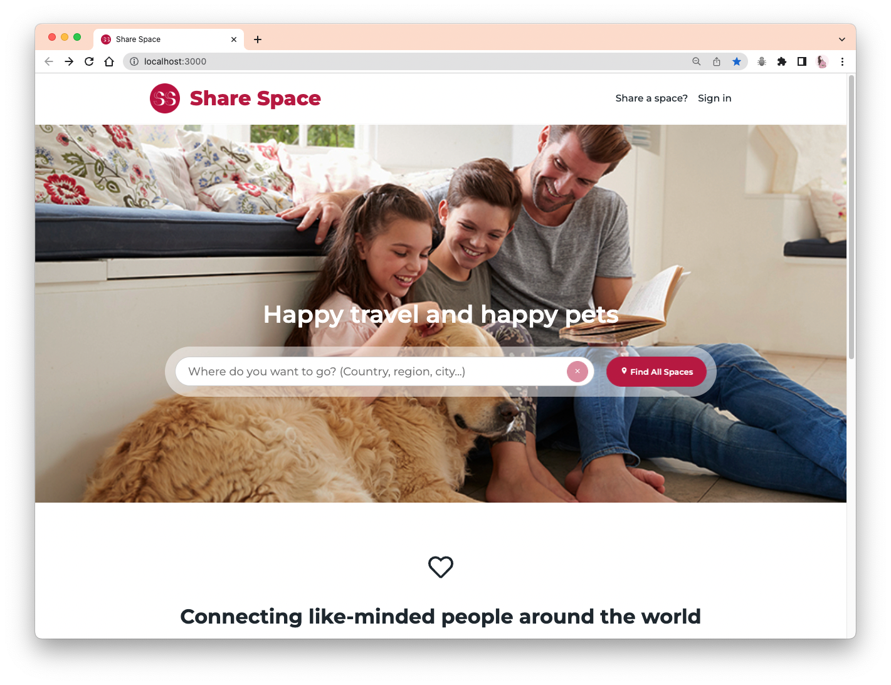
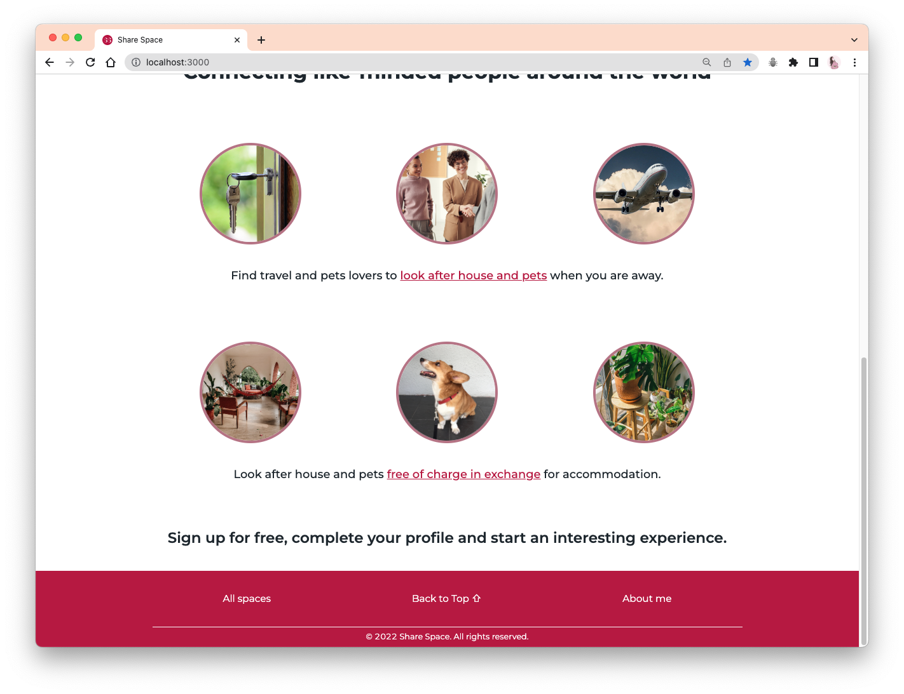
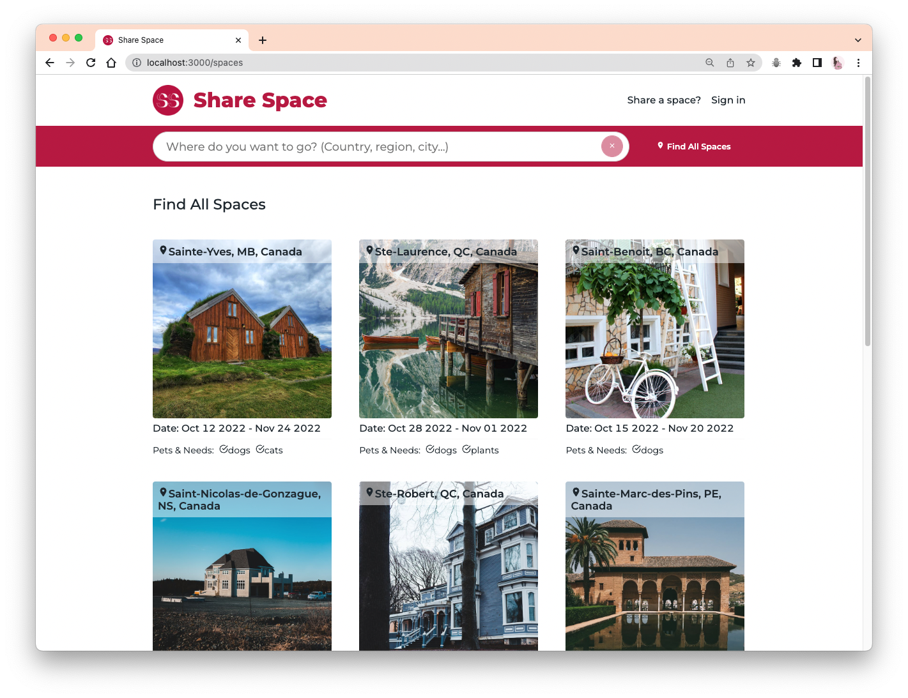
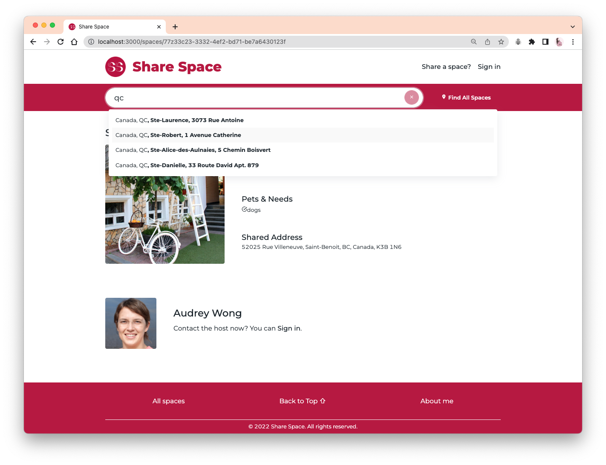
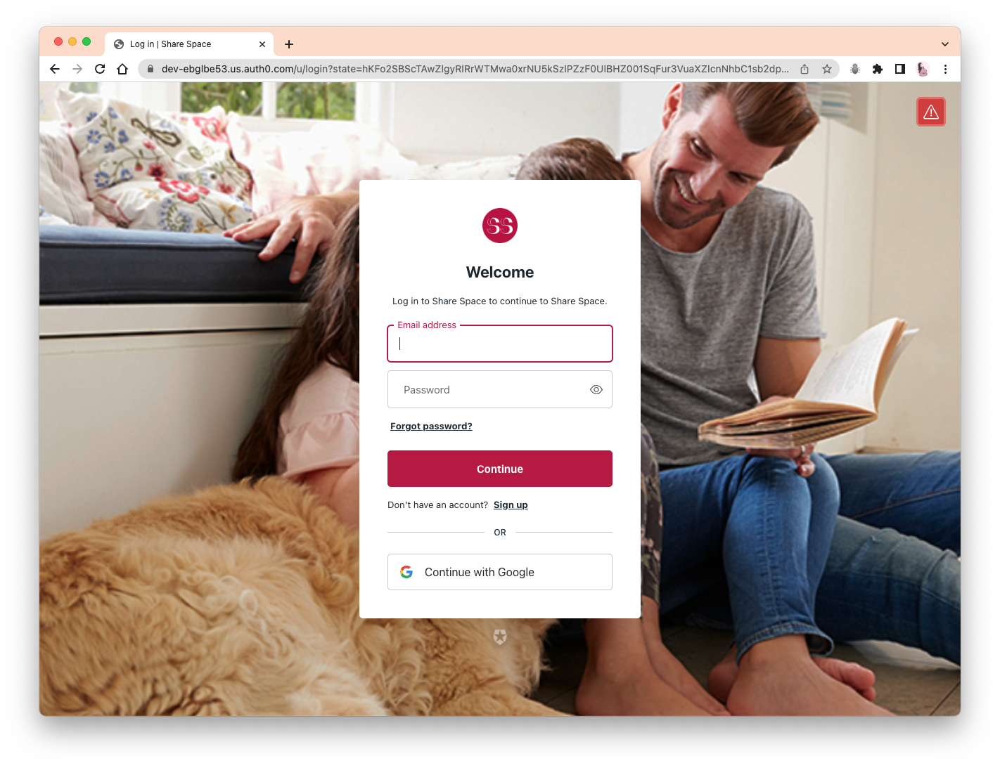
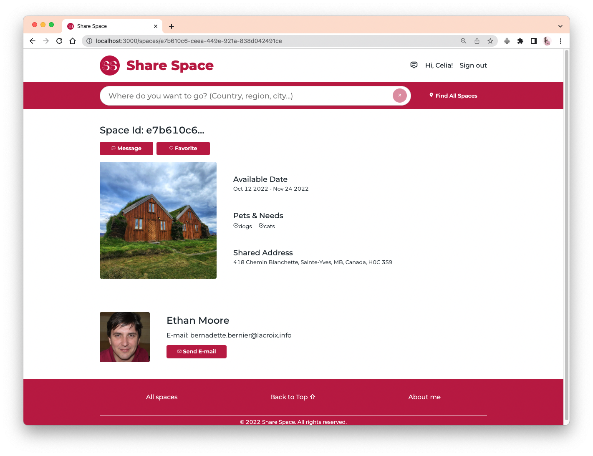
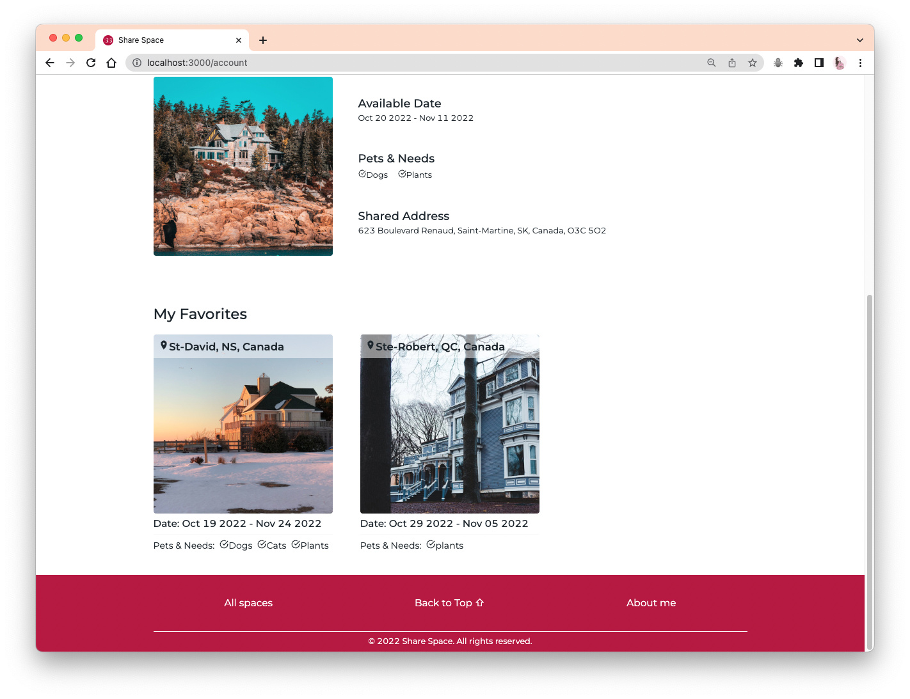
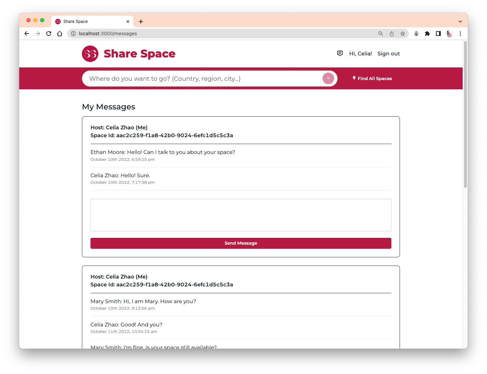

# Share-Space

A multi-page modern website for users in exchange for free accommodation by helping other users who will be traveling or go away to look after their house, pets and plants. Space means free accommodation shared by users, but also house, pets and plants that need to be looked after.

### YouTube Video: [Share Space Demo - Wenjing Zhao](https://youtu.be/42zPMd1XzLg)

- Features: space display, space search, user login and authentication, user post/update/delete space, user favorites, user send/reply/receive messages.
- Techniques: HTML, CSS, JavaScript, ReactJS, NodeJS, Express, MongoDB.
- APIs & Packages: auth0, cloudinary, styled-components, react-icons, antd, moment, uuid, dotenv, etc.

# Screenshots

### Homepage (Header, Search bar)

### Homepage (Introductions, Footer)

### Spaces Page

### Search Bar

### Signin/Signup Page

### Space Page

### Account Page (Profile, Add/Edit/Delete Space)

### Account Page (Favorites)

### Messages Page

