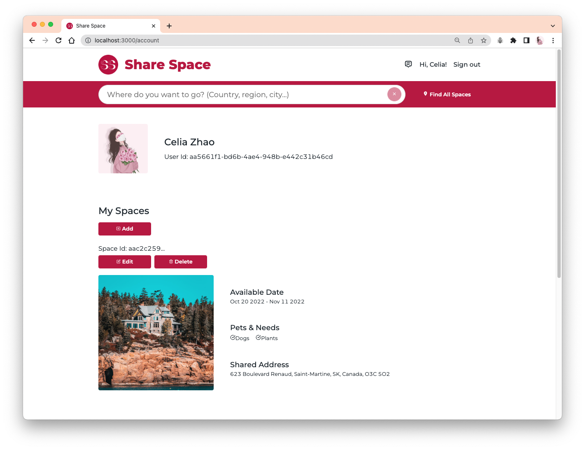

# Share-Space

A multi-page modern website for users in exchange for free accommodation by helping other users who will be traveling or go away to look after their houses and pets.

### YouTube link: [Share Space Demo - Wenjing Zhao](https://youtu.be/42zPMd1XzLg)

- Functionalities: user signin and authentication, search, publication, favorites, messages etc.
- Techniques: HTML, CSS, JavaScript, ReactJS, NodeJS, Express, MongoDB
- APIs & Packages: auth0, cloudinary, styled-components, react-icons, ant-design, moment, uuid, dotenv etc.

### Screenshot - Homepage (Header, Big search bar)

### Screenshot - Homepage (Introductions, Footer)

### Screenshot - Spaces Page

### Screenshot - Small search bar

### Screenshot - Signin/Signup Page

### Screenshot - Space Page

### Screenshot - Account Page (Profile, Add/Edit/Delete Space)

### Screenshot - Account Page (Favorites)

### Screenshot - Messages Page

